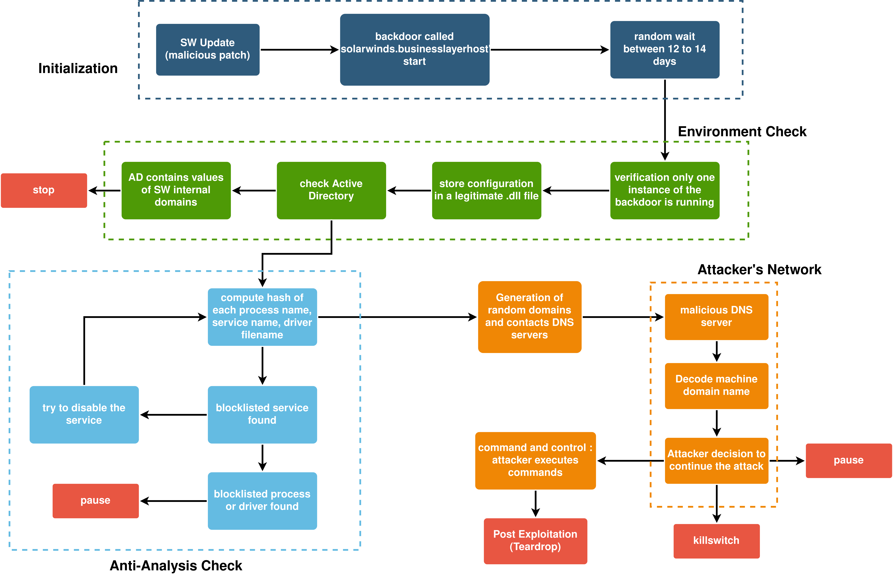

# cyberrrange

Ce projet a été mené par 3 étudiants de CentraleSupelec en dernière année en mention cybersécurité (Vangelis Hoareau, Tanguy Boisset et Thomas Girard) et a eu pour but de comprendre, reproduire et implémenter sur l'outil CyberRange d'Airbus l'attaque informatique Sunburst qui a touché les clients de SolarWinds. Une documentation ainsi que les slides de la soutenance finale sont présents dans le dossier 'documentation'.

Nous remercions enfin notre encadrant Nicolas Scouarnec et Valérie Viet Triem Tong pour leurs disponibilités et leurs conseils tout au long du projet !

