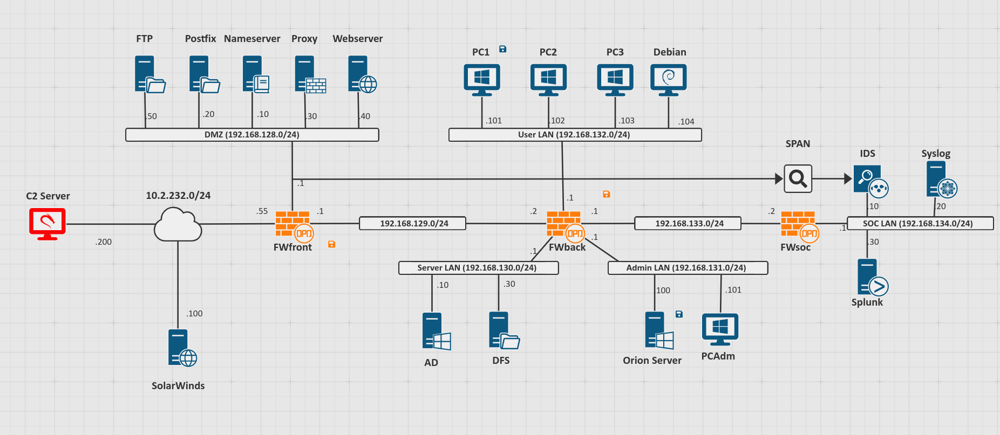

# Documentation Projet Solarwinds CyberRange  

 
 

## Introduction : 

 
 

Déroulement temporel de l'attaque SolarWinds : 

 

 
 

## Contenu du livrable :  

 

- Un dossier contenant le programme de mise à jour du logiciel ciblé : `Obfuscation` 

 

 

- Un dossier contenant le programme de mise à jour du logiciel ciblé : `OrionUpdate`  

 
 

- Un dossier contenant le programme d’analyse d’environnement : `EnvironmentCheck`  

 
 

- Un dossier contenant le programme de découverte de domaine d’active directory (TBI) : `DomainDiscovery`  

 
 

- Un dossier contenant le programme de détection d’outil d’analyse : `antiAnalysisCheck`  

 
 

- Un dossier contenant le programme de génération aléatoire de domaine : `DGA`  

 
 

- Un dossier contenant le programme ouvrant une backdoor HTTP : `Dns_backdoor`  

 
 

- Un dossier contenant le programme ouvrant une backdoor TCP (TBR?) : `BackdoorLinux`  

 
 

- Un dossier img contenant différentes images liées à _SolarWinds_ 

 
 

## Description de chaque programme 

 
 

### 1. OrionUpdate 

Contient le code et l'exécutable au départ du scénario. Celui lance une mise à jour vérolée du serveur Orion qu'il va chercher sur un serveur SolarWinds distant. Celle-ci contiendra toutes les autres parties qui suivent. 

### 2. EnvironmentCheck 

Ce dossier contient la partie du programme chargée de : 

- Vérifier qu'une autre instance n'est pas déjà en cours d'exécution. 

- Vérifier si le fichier de configuration SolarWinds.Orion.Core.BusinessLayer.dll est présent et lisible. 

- Vérifier si le champ ReportWatcherRetry du fichier SolarWinds.Orion.Core.BusinessLayer.dll n'a pas une certaine valeur indiquant au malware de s'arrêter. 

### 3. discoverDomain 

Ce dossier contient la partie du programme chargée de découvrir le nom de domaine de l'active directory sur lequel est déployé l'hôte. Ceci permet de reconnaître un domaine parmis une liste de nom sur lequel l'attaquant ne voudrait pas opérer, comme par exemple le domaine de l'entreprise SolarWinds, souche de l'attaque. 

### 4. antiAnalysisCheck 

Ce dossier contient la partie chargée de détecter si un processus ou un service représente une menace pour le bon déroulement de l'attaque. Le programme liste les processus et services en cours sur l'hôte, et possède une liste hardcodée de programmes que le malware tentera d'éviter en tentant de les arrêter ou en stoppant l'attaque. 

### 5. DGA 

Ce dossier contient l'algorithme de génération de noms de domaines aléatoires  

### 6. Dns_backdoor 

Ce dossier contient la backdoor qu'ouvrira le malware chez la victime. Il s'agit d'un client HTTP qui va communiquer de manière obfusquée avec le serveur C&C de l'attaquant afin de récupérer des ordres grâce à des requêtes GET/POST et exécuter des commandes sur l'hôte. 

### 7. BackdoorLinux? 

 
 

## Topologie sur Cyberrange

 
 

Dans cette modélisation nous avons choisi une topologie d'entreprise basée sur un Active Directory. Un serveur Orion est déployée sur un réseau dit "admin".  

 
 

## L'attaque 

 
 

Nous avons essayé de représenter fidèlement la logique de l'intrusion des attaquants dans le réseau de leurs victimes, en prenant en compte leur attention particulière à la discrétion. Puis nous avons implémenté nous-même une attaque réaliste une fois la backdoor créée. 

 
 

### Scénario 

 
 

Une fois en possession d'une backdoor vers le serveur Orion de l'entreprise, l'attaque lance une reconnaissance sur le réseau sur lequel il est présent ... [à continuer] 

 
 

### Implémentation des actions sur CyberRange 

 
 

Afin de créer un scénario sur l'outil CyberRange, nous avons découpé l'attaque de manière logique afin de montrer visuellement et temporellement la chaîne de décision ainsi que l'attaque. Dans l'espace CyberRange dédié à l'attaque vous trouverez X actions qui constitueront le coeur du scénario. 

#### __Les différentes actions :__ 

- `Initialisation Orion` : Cette action est un pré-requis au scénario à jouer sur l'hôte qui servira de machine victime. Elle crée le répertoire `Orion` et `Orion\modules` à l'emplacement `C:\"Program Files (x86)"\Orion\`

- `Installation Orion` : Cette action est un pré-requis au scénario à jouer sur l'hôte qui servira de machine victime. Elle upload le fichier `Installation Orion.tar` et le  désarchive dans le `C:\"Program Files (x86)"\Orion\`. Ne possédant pas la licence _Orion_, cette archive contient un programme qui jouera le rôle de couche graphique simulant le bon fonctionnement du logiciel ciblé.
Cette archive contient :
    - `orion.exe` : un 'dummy program' dont le but est de symboliser le logiciel légitime de Solarwinds
    - un faux fichier de licence
    - le logo de SolarWinds
    - un faux fichier de configuration `OrionUpdateRequest.conf`
    - `update.exe` : programme légitime permettant de mettre à jour Orion

- `Update Orion` : Cette action est le départ de l'attaque. Elle exécute `orionUpdate.exe` qui télécharge les fichiers suivants dans le répertoire `C:/Program Files (x86)/Orion/modules/`
    - `environmentCheck.exe`
    - `DomainDiscovery.exe` 
    - `antiAnalysisCheck.exe`
    - `Dns_backdoor.exe` 

- `Environment Checking`: L'action exécute EnvironmentCheck.exe qui se situe dans le repertoire `C:/Program Files (x86)/Orion/modules/envCheck.exe`

- `Domain Discovery`: L'action exécute EnvironmentCheck.exe qui se situe dans le repertoire `C:/Program Files (x86)/Orion/modules/DomainDiscovery.exe`

- `Anti-Analysis Check`: L'action exécute Anti-AnalysisCheck.exe qui se situe dans le repertoire `C:/Program Files (x86)/Orion/modules/anti_analysis.exe`

- `Dns_backdoor`: L'action exécute Anti-AnalysisCheck.exe qui se situe dans le repertoire `C:/Program Files (x86)/Orion/modules/anti_analysis.exe`
 

## Faire marcher la machine Orion :  

Ci-dessous figurent les diverses instructions concernant le bon déroulement technique de l'attaque sur notre topologie.

**Pare-feu** : par manque de temps, les pare-feu ont été simplement désactivés dans la topologie fournie. Pour une meilleure représentation de la réalité, il serait préférable d'ajouter des règles de NAT ainsi que de whitelister les échanges provenant du serveur Orion.
 
**Se connecter aux machines** : il est possible de se connecter aux machines avec le compte administrateur de l'Active Directory en utilisant les credentials suivant :
- User : `SIGEN\Administrator`
- Password : `SIGEN\Administrator`

**Redémarrage de l'AD** : pour des raisons inconnues, les machines AD et DFS s'éteignent toutes les 2h30 environ. Pour que l'attaque fonctionne, la machine AD doit être rédémarrée et il faut se connecter avec les credentials ci-dessus.
 
**Redémmarrage d'Orion** : la machine Orion a aussi tendance a reboot sans raison particulière. Pour que l'attaque fonctionne, il faut procéder aux manipulations suivantes (il serait préférable à terme d'automatiser ces opérations) :
- Démarrer un shell Powershell
- Lancer la commande `Test-NetConnection sigen.net -port 9389`
- Vérifier que la connexion est opérationnelle avec la commande `Get-ADDomain -Identity sigen.net`
- *En cas d'échec* : Lancer la commande `Set-ExecutionPolicy RemoteSigned`

**Commandes au LDAP** : pour envoyer des commandes au LDAP, il faut :
- Avoir installé le module activedirectory sur la machine Orion (c'est déjà le cas sur la mâchine fournie). Sinon, lancer la commande `import-module activedirectory` dans un Powershell.
- Préciser l'identité à contacter en rajoutant `-Identity sigen.net`.
 

 
 
 
 
 

 