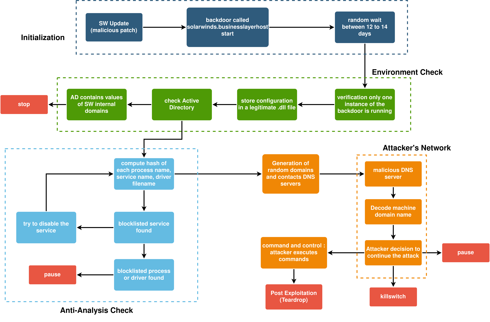

# Documentation Projet Solarwinds CyberRange  

 
 

## Introduction : 

 
 

Déroulement temporel de l'attaque SolarWinds : 

 

 
 

## Contenu du livrable :  

 

- Un dossier contenant le programme de mise à jour du logiciel ciblé : `Obfuscation` 

 

 

- Un dossier contenant le programme de mise à jour du logiciel ciblé : `OrionUpdate`  

 
 

- Un dossier contenant le programme d’analyse d’environnement : `EnvironmentCheck`  

 
 

- Un dossier contenant le programme de découverte de domaine d’active directory (TBI) : `DomainDiscovery`  

 
 

- Un dossier contenant le programme de détection d’outil d’analyse : `antiAnalysisCheck`  

 
 

- Un dossier contenant le programme de génération aléatoire de domaine : `DGA`  

 
 

- Un dossier contenant le programme ouvrant une backdoor HTTP : `Dns_backdoor`  

 
 

- Un dossier contenant le programme ouvrant une backdoor TCP (TBR?) : `BackdoorLinux`  

 
 

- Un dossier img contenant différentes images liées à _SolarWinds_ 

 
 

## Description de chaque programme 

 
 

### 1. OrionUpdate 

Contient le code et l'exécutable au départ du scénario. Celui lance une mise à jour vérolée du serveur Orion qu'il va chercher sur un serveur SolarWinds distant. Celle-ci contiendra toute les autres parties qui suivent. 

### 2. EnvironmentCheck 

Ce dossier contien la partie du programme chargée de : 

- Vérifier qu'une autre instance n'est pas déjà en cours d'exécution. 

- Vérifier si le fichier de configuration SolarWinds.Orion.Core.BusinessLayer.dll est présent et lisible. 

- Vérifier si le champ ReportWatcherRetry du fichier SolarWinds.Orion.Core.BusinessLayer.dll n'a pas une certaine valeur indiquant au malware de s'arrêter. 

### 3. discoverDomain 

Ce dossier contient la partie du programme chargée de découvrir le nom de domaine de l'active directory sur lequel est déployé l'hôte. Ceci permet de reconnaître un domaine parmis une liste de nom sur lequel l'attaquant ne voudrait pas opérer, comme par exemple le domaine de l'entreprise SolarWinds, souche de l'attaque. 

### 4. antiAnalysisCheck 

Ce dossier contient la partie chargée de détecter si un processus ou un service représente une menace pour le bon déroulement de l'attaque. Le programme liste les processus et services en cours sur l'hôte, et possède une liste hardcodée de programmes que le malware tentera d'éviter en tentant de les arrêter ou en stoppant l'attaque. 

### 5. DGA 

Ce dossier contient l'algorithme de génération de nom de domaines aléatoires  

### 6. Dns_backdoor 

Ce dossier contient la backdoor qu'ouvrira le malware chez la victime. Il s'agit d'un client HTTP qui va communiquer de manière obfusquée avec le serveur C&C de l'attaquant afin de récupérer des ordres grâce à des requêtes GET/POST et exécuter des commandes sur l'hôte. 

### 7. BackdoorLinux? 

 
 

## Topologie sur Cyber 

 
 

Dans cette modélisation nous avons choisi une topologie d'entreprise basée sur un Active Directory. Un serveur Orion est déployée sur un réseau dit "admin".  

 
 

## L''attaque 

 
 

Nous avons essayé de représenter fidèlement la logique de l'intrusion des attaquants dans le réseau de leurs victimes, en prenant en compte leur attention particulière à la discrétion. Puis nous avons implémenté nous-même une attaque réaliste une fois la backdoor créée. 

 
 

### Scénario 

 
 

Une fois en possession d'une backdoor vers le serveur Orion de l'entreprise, l'attaque lance une reconnaissance sur le réseau sur lequel il est présent ... [à continuer] 

 
 

### Implémentation des actions sur CyberRange 

 
 

Afin de créer un scénario sur l'outil CyberRange, nous avons découpé l'attaque de manière logique afin de montrer visuellement et temporellement la chaîne de décision ainsi que l'attaque. Dans l'espace CyberRange dédié à l'attaque vous trouverez X actions qui constitueront le coeur du scénario. 

#### __Les différentes actions :__ 

- `Initialisation Orion` : Cette action est un pré-requis au scénario à jouer sur l'hôte qui servira de machine victime. Elle crée le répertoire `Orion` et `Orion\modules` à l'emplacement `C:\"Program Files (x86)"\Orion\`

- `Installation Orion` : Cette action est un pré-requis au scénario à jouer sur l'hôte qui servira de machine victime. Elle upload le fichier `Installation Orion.tar` et le  désarchive dans le `C:\"Program Files (x86)"\Orion\`. Ne possédant pas la licence _Orion_, cette archive contient un programme qui jouera le rôle de couche graphique simulant le bon fonctionnement du logiciel ciblé.
Cette archive contient :
    - a
    - a
    - a

- `Update Orion` : Cette action est le départ de l'attaque. Elle exécute `orionUpdate.exe` qui télécharge les fichiers suivants dans le répertoire `C:/Program Files (x86)/Orion/modules/`
    - `environmentCheck.exe`
    - `DomainDiscovery.exe` 
    - `antiAnalysisCheck.exe`
    - `Dns_backdoor.exe` 

- `Environment Checking`: L'action exécute EnvironmentCheck.exe qui se situe dans le repertoire `C:/Program Files (x86)/Orion/modules/envCheck.exe`

- `Domain Discovery`: L'action exécute EnvironmentCheck.exe qui se situe dans le repertoire `C:/Program Files (x86)/Orion/modules/DomainDiscovery.exe`

- `Anti-Analysis Check`: L'action exécute Anti-AnalysisCheck.exe qui se situe dans le repertoire `C:/Program Files (x86)/Orion/modules/anti_analysis.exe`

- `Dns_backdoor`: L'action exécute Anti-AnalysisCheck.exe qui se situe dans le repertoire `C:/Program Files (x86)/Orion/modules/anti_analysis.exe`
 

## Faire marcher la machine Orion :  

 
 

Bug avec l’AD : s’éteint tout seul sans raison. Il faut le redémarrer et se connecter dessus pour que tout remarche (avec SIGEN\Administrator:SIGEN\Administrator)  

 
 

Orion Server : pour se connecter à l’AD, on utilise la variable d’environnement LOGONSERVER qui par défault n’est pas correcte. Il faut la changer avec la commande suivante (sur PowerShell) :  

 
 

$env:LOGONSERVER=”\\AD”  

 
 

Puis vérifier la connexion avec la commande :  

 
 

Test-NetConnection sigen.net -port 9389  

 
 

Pour faire les commandes de l’AD, ajouter –Identity sigen.net  

 

Activer cette commande sur le serveur pour pouvoir faire des commandes PowerShell depuis le malware :  

Set-ExecutionPolicy RemoteSigned 

 
 
 
 
 

 